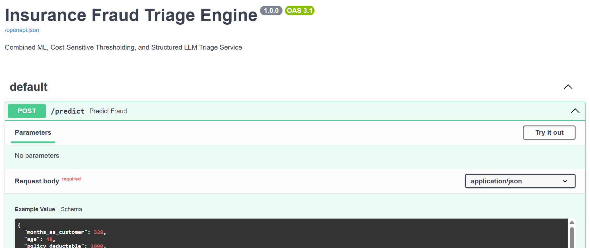
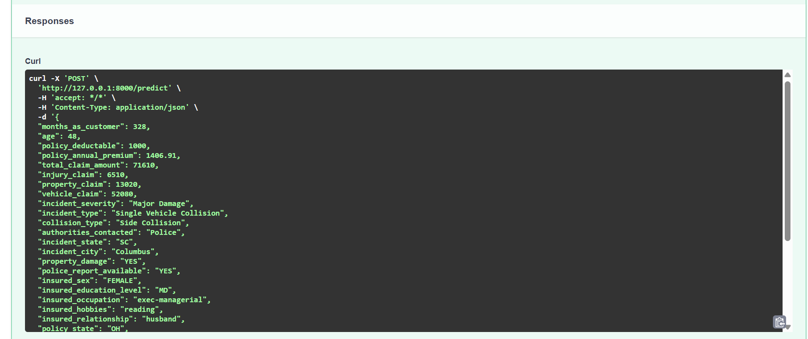

# Insurance Fraud Triage Engine

An end-to-end **AI-powered insurance fraud triage system** that combines **Machine Learning, SHAP explainability, cost-sensitive thresholding, and Google Gemini LLM-based audit reporting**.

The system analyzes insurance claims, estimates fraud probability using an **XGBoost classifier**, identifies the key factors influencing the prediction using **SHAP**, applies an optimized decision threshold, and generates a structured audit report using an LLM.

---

## 🚀 Project Overview

Insurance claim investigation can involve a large number of claims, making it difficult to manually investigate every case.

This project provides a **fraud triage pipeline** that helps prioritize claims for further investigation.

### The system performs four major tasks

1. **Fraud Prediction**
   - Uses an XGBoost classification model to estimate the probability that a claim may be fraudulent.

2. **Explainable AI**
   - Uses SHAP to identify the most influential features behind the prediction.

3. **Risk-Based Triage**
   - Uses an optimized fraud probability threshold to determine whether a claim should pass or be escalated.

4. **LLM Audit Generation**
   - Uses Google Gemini to convert the ML prediction and SHAP explanations into a structured investigation summary.

## 📸 Screenshots

### FastAPI Swagger Documentation

The project exposes an interactive REST API through FastAPI and Swagger UI.



### Fraud Triage Prediction

The `/predict` endpoint returns the ML fraud probability, optimized decision threshold, SHAP feature attributions, and structured Gemini-generated audit report.



---

## 🧠 System Architecture

```text
                Insurance Claim
                       │
                       ▼
              ┌─────────────────┐
              │ Data Preprocessing│
              │ Pipeline         │
              └────────┬────────┘
                       │
                       ▼
              ┌─────────────────┐
              │ XGBoost Model   │
              │ Fraud Prediction│
              └────────┬────────┘
                       │
             Fraud Probability
                       │
          ┌────────────┴────────────┐
          ▼                         ▼
   ┌─────────────┐          ┌────────────────┐
   │ SHAP        │          │ Decision       │
   │ Explainability│        │ Threshold      │
   └──────┬──────┘          └───────┬────────┘
          │                         │
          └────────────┬────────────┘
                       ▼
              ┌─────────────────┐
              │ Gemini LLM      │
              │ Triage Audit    │
              └────────┬────────┘
                       │
                       ▼
              Structured Audit
                  Report
```

---

## ✨ Key Features

- XGBoost-based fraud classification
- Fraud probability scoring
- SHAP-based model explainability
- Cost-sensitive decision threshold
- Automated claim triage
- Structured LLM-generated audit report
- FastAPI REST API
- Swagger API documentation
- Pydantic structured output validation
- Google Gemini API integration
- Modular Python architecture

---

## 🛠️ Technology Stack

| Category | Technologies |
|---|---|
| Programming | Python |
| Machine Learning | XGBoost, Scikit-learn |
| Explainable AI | SHAP |
| Data Processing | Pandas, NumPy |
| API | FastAPI |
| Validation | Pydantic |
| Generative AI | Google Gemini |
| Model Serialization | Joblib, XGBoost JSON |
| API Server | Uvicorn |

---

## 📁 Project Structure

```text
insurance-fraud-triage-engine/
│
├── app/
│   ├── __init__.py
│   ├── main.py
│   └── ui.py
│
├── data/
│   └── raw_claims.csv
│
├── models/
│   ├── preprocessor.pkl
│   ├── threshold_config.json
│   └── xgb_fraud_model.json
│
├── src/
│   ├── __init__.py
│   ├── explain.py
│   ├── preprocessing.py
│   ├── train.py
│   └── triage.py
│
├── .gitignore
├── requirements.txt
└── README.md
```

### Main Components

**`src/train.py`**  
Handles model training and model artifact generation.

**`src/preprocessing.py`**  
Contains the preprocessing pipeline used to transform claim data before prediction.

**`src/explain.py`**  
Generates SHAP-based feature attributions to explain individual predictions.

**`src/triage.py`**  
Connects the prediction and explainability outputs to Google Gemini and generates a structured audit report.

**`app/main.py`**  
FastAPI application exposing the fraud prediction API.

**`models/`**  
Contains the trained model, preprocessing pipeline, and optimized threshold configuration.

---

# 🔄 Prediction Workflow

When a claim is submitted to `/predict`, the following process takes place:

### 1. Claim Input

The API receives structured insurance claim information such as:

- Customer information
- Policy information
- Incident details
- Claim amounts
- Vehicle information
- Incident severity
- Property damage
- Police report availability

### 2. Preprocessing

The trained preprocessing pipeline transforms the raw claim into the feature representation expected by the ML model.

### 3. Fraud Prediction

The XGBoost model calculates:

```text
Fraud Probability
```

Example:

```text
Fraud Probability: 0.6253
```

This represents a model-estimated probability, not a definitive determination of fraud.

### 4. SHAP Explanation

SHAP identifies features that contributed most strongly to the prediction.

Example:

```text
incident_severity    +1.598
property_claim       -0.155
capital-gains        -0.114
```

### 5. Decision Threshold

The predicted probability is compared with the configured threshold.

Example:

```text
Fraud Probability : 62.53%
Threshold         : 17.00%

Decision           : ESCALATE_SIU
```

### 6. LLM Audit

The fraud probability, threshold, claim information, and SHAP factors are passed to Gemini.

The LLM generates a structured audit containing:

- Risk category
- Recommended action trigger
- Supporting evidence
- Investigation notes

---

# 📊 Example Output

A successful prediction returns a response similar to:

```json
{
  "fraud_probability": 0.6253,
  "optimal_threshold": 0.17,
  "decision": "ESCALATE_SIU",
  "top_shap_features": [
    {
      "feature": "incident_severity",
      "attribution": 1.598
    },
    {
      "feature": "property_claim",
      "attribution": -0.155
    }
  ],
  "llm_triage_audit": {
    "risk_category": "High Risk / Fraud Suspected",
    "action_trigger": "SIU Escalation",
    "supporting_evidence": [
      "incident_severity: Major Damage (+1.598)",
      "property_claim: High property loss component",
      "capital-gains: Zero capital gains recorded"
    ],
    "audit_notes": "..."
  }
}
```

---

# ⚙️ Installation & Setup

## 1. Clone the Repository

```bash
git clone https://github.com/YOUR_USERNAME/insurance-fraud-triage-engine.git
cd insurance-fraud-triage-engine
```

Replace `YOUR_USERNAME` with your GitHub username.

---

## 2. Create a Virtual Environment

Python 3.12 is recommended for the current project setup.

### Windows

```powershell
py -3.12 -m venv venv
```

Activate it:

```powershell
.\venv\Scripts\Activate.ps1
```

---

## 3. Install Dependencies

```powershell
python -m pip install -r requirements.txt
```

The project also requires the Google GenAI SDK:

```powershell
python -m pip install google-genai
```

> **Note:** Add `google-genai` to `requirements.txt` before publishing if it is not already included.

---

# 🔐 Gemini API Configuration

The LLM audit component requires a Gemini API key.

Create a `.env` file in the project root:

```text
GEMINI_API_KEY=your_api_key_here
```

### Important

The `.env` file should **never be committed to GitHub**.

The API key must be kept private.

---

# ▶️ Running the Application

From the project root:

```powershell
python -m uvicorn app.main:app --host 127.0.0.1 --port 8000
```

The API will be available at:

```text
http://127.0.0.1:8000
```

---

# 📖 API Documentation

FastAPI automatically provides interactive Swagger documentation.

Open:

```text
http://127.0.0.1:8000/docs
```

From Swagger UI, use:

```text
POST /predict
```

to submit an insurance claim and receive the complete fraud triage result.

---

# 🧪 Example API Request

Example request body:

```json
{
  "months_as_customer": 328,
  "age": 48,
  "policy_deductable": 1000,
  "policy_annual_premium": 1406.91,
  "total_claim_amount": 71610,
  "injury_claim": 6510,
  "property_claim": 13020,
  "vehicle_claim": 52080,
  "incident_severity": "Major Damage",
  "incident_type": "Single Vehicle Collision",
  "collision_type": "Side Collision",
  "authorities_contacted": "Police",
  "incident_state": "SC",
  "incident_city": "Columbus",
  "property_damage": "YES",
  "police_report_available": "YES"
}
```

The API returns:

- Fraud probability
- Decision
- SHAP explanations
- Risk category
- Supporting evidence
- LLM-generated audit notes

---

# 🧩 Decision Logic

The system uses the configured threshold stored in:

```text
models/threshold_config.json
```

Conceptually:

```text
                 Fraud Probability
                        │
              ┌─────────┴─────────┐
              │                   │
          Below Threshold     At/Above Threshold
              │                   │
              ▼                   ▼
             PASS           ESCALATE_SIU
```

The threshold is part of the model's triage configuration and should be interpreted together with the model's performance and business requirements.

---

# 🔍 Explainable AI

Instead of returning only a fraud probability, the system uses **SHAP** to provide feature-level explanations.

This improves transparency by showing which features contributed to an individual prediction.

For example:

```text
incident_severity
        │
        └── Positive contribution

property_claim
        │
        └── Negative contribution

capital-gains
        │
        └── Negative contribution
```

This allows the audit process to use both the **prediction and its explanation**.

---

# 🤖 Generative AI Audit Layer

The Gemini component does not replace the ML model.

Instead, it acts as an **interpretation and reporting layer**.

### ML provides

```text
Fraud Probability
       +
SHAP Feature Contributions
       +
Decision Threshold
```

### Gemini provides

```text
Structured Risk Category
       +
Action Trigger
       +
Supporting Evidence
       +
Audit Notes
```

The structured response is validated using a Pydantic schema.

---

# 🎯 Project Objective

The goal of this project is to demonstrate how traditional machine learning and generative AI can be combined into an explainable decision-support workflow.

Rather than producing only:

```text
Fraud = Yes/No
```

the system produces:

```text
Probability
    +
Explanation
    +
Triage Decision
    +
Structured Audit
```

This demonstrates the integration of:

- Machine Learning
- Explainable AI
- Generative AI
- REST APIs
- Structured outputs
- Decision-support workflows

---

# ⚠️ Disclaimer

This project is an experimental machine-learning and generative-AI application for **fraud triage and decision support**.

The model output should not be treated as a definitive determination of insurance fraud. Real-world insurance decisions require appropriate human review, domain expertise, regulatory compliance, and validated production systems.

---

# 👩‍💻 Author

**Anusha C**

B.Tech Information Technology Graduate (2026)

**Focus:** Machine Learning | Data Science | Generative AI

**GitHub:** `AnushaC-04`
